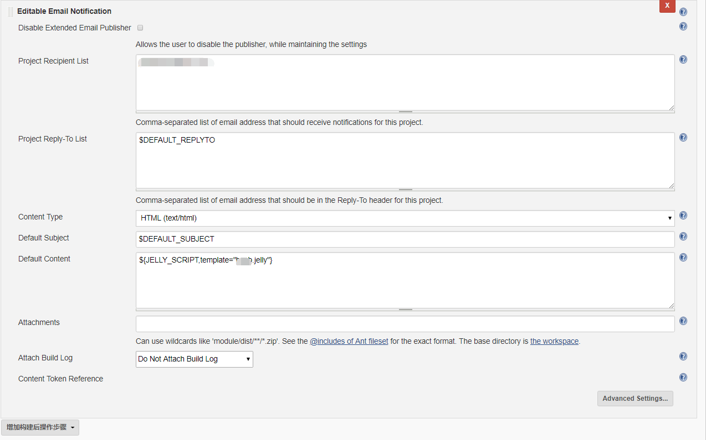

# 如何在Ranorex中设置邮件发送？
需要创建一个Code Module，这里使用一个System.Net.Mail，需要配置smtp服务器，
```C#
/*
 * Created by Ranorex
 * User: Joey Jiang
 * Date: 2018/3/15
 * Time: 14:46
 * 
 * To change this template use Tools | Options | Coding | Edit Standard Headers.
 */
using System;
using System.Collections.Generic;
using System.Text;
using System.Text.RegularExpressions;
using System.Drawing;
using System.Threading;
//添加
using System.Windows.Forms;
using System.Net.Mail;
using System.Data;
	
using Ranorex;
using Ranorex.Core;
using Ranorex.Core.Testing;


namespace HSPB.Code
{
    /// <summary>
    /// Description of SendEmail.
    /// </summary>
    [TestModule("56BCD459-44D0-42A0-8DE5-07EA563830F3", ModuleType.UserCode, 1)]
    public class SendEmail : ITestModule
    {
        /// <summary>
        /// Constructs a new instance.
        /// </summary>
        public SendEmail()
        {
            // Do not delete - a parameterless constructor is required!
        }

        /// <summary>
        /// Performs the playback of actions in this module.
        /// </summary>
        /// <remarks>You should not call this method directly, instead pass the module
        /// instance to the <see cref="TestModuleRunner.Run(ITestModule)"/> method
        /// that will in turn invoke this method.</remarks>
        void ITestModule.Run()
        {
        	Sendemail();
        }
        
        public void Sendemail()
        {
        	MailMessage mail = new MailMessage();
            mail.From = new MailAddress( "A@163.com");
            mail.To.Add("B@163.com");
            mail.Subject = "Test Mail";
            mail.Body = "mail with attachment";
            mail.BodyEncoding = Encoding.UTF8;  
            mail.IsBodyHtml = true;  
            
            SmtpClient SmtpServer = new SmtpClient();
            SmtpServer.Host = "smtp.163.com"; //配置邮件smtp服务器
            SmtpServer.Port = 25;    //非ssl端口号使用25
            SmtpServer.Credentials = new System.Net.NetworkCredential("*", "*"); 
            //这里*代表两个参数，一个参数是@163.com之前的用户名，一个参数是在163页面设置的授权码,这里我搞了很长时间，
            //SmtpServer.enableSsl这个不需要的。

            System.Net.Mail.Attachment attachment;
            attachment = new System.Net.Mail.Attachment("自动化测试报告.rxzlog");
            mail.Attachments.Add(attachment);
            
            try
			      { 
                SmtpServer.Send(mail);
                MessageBox.Show("mail Send");
            }
            catch (Exception ex)
            {
            	Report.Failure("Mail Error: " + ex.ToString());
            }

        }
    }
}
```

# 在jenkins中配置邮件发送
如果Ranorex配置到了jenkins中，那么你可以通过jenkins的邮件发送插件来发送邮件。


